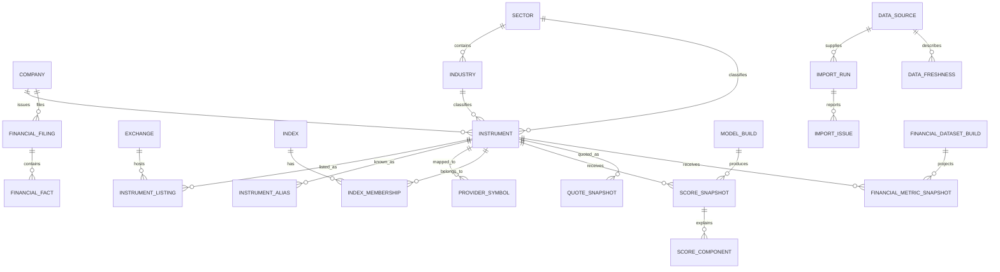

# Canonical platform foundation

Implemented: 2026-08-01; Phase 4 normalized financial lineage added

This document describes the Phase 1 relational, identity, provider and API
foundation. The current static publisher remains the production compatibility
frontend. The canonical database is opt-in until a PostgreSQL service is
configured and migrated outside public request handling.

## Architecture decision

The project now uses two stores for different workloads:

- DuckDB remains the embedded research ledger used by historical CLI and
  backtest workflows. Its additive compatibility migrations add canonical
  `instrument_id` and `build_id` links without rewriting old rows.
- SQLAlchemy 2 and Alembic define the canonical relational platform schema.
  PostgreSQL is the production target because it supports concurrent,
  server-side filtered/paginated API and future user data. SQLite is supported
  for local development and deterministic tests where the exercised semantics
  are compatible.

The weekly static build does not require PostgreSQL. It creates canonical IDs
and a reproducible build manifest in memory, saves linkage in DuckDB, and emits
versioned JSON. A temporary database outage therefore cannot take down the
existing public ranking build.

## Entity relationship model



Core values are relational and constrained. JSON is limited to flexible import
summaries, provider versions, and raw/provenance metadata. Financial values use
decimal columns. Timestamps are UTC-capable. Current listing/provider mappings
have partial unique indexes, and ranking rows are unique by build/instrument
and build/rank.

## Instrument identity rules

`instrument_id` is the permanent security identity. A ticker is never a new
schema primary key.

Resolution and import rules:

1. An exact ISIN is the strongest cross-source continuity key for a security.
2. An existing active provider mapping or exact exchange symbol can identify a
   record when it points to only one instrument.
3. A symbol/name/provider change updates the existing instrument when a
   stronger identifier establishes continuity. The old value is retained as a
   dated listing or alias.
4. BSE and NSE listings may belong to one instrument when source identity
   establishes that they represent the same security. One listing is primary.
5. Delisting closes a listing; it does not delete the instrument or its score
   history. Relisting is linked only when ISIN or reviewed source evidence
   establishes continuity.
6. Corporate restructurings that create a genuinely new security receive a new
   ID even when names are similar.
7. Similar company names alone never cause a merge. Multiple matches create an
   `import_issues` row in unresolved/review state.
8. Current provider symbols are unique per provider. A collision is reported,
   not overwritten.

Bootstrap IDs use UUIDv5. ISIN is preferred; otherwise the initial exchange and
symbol seed the ID. Once stored, the ID is immutable and is not recomputed after
a symbol change.

Search ranking is conservative:

1. exact primary exchange symbol;
2. exact BSE code;
3. exact ISIN;
4. exact provider symbol;
5. exact legal/display name, including safe company-suffix normalization;
6. exact alias/former name;
7. name prefix;
8. fuzzy name match only for queries of at least five characters and a guarded
   similarity threshold.

Every candidate includes `matched_by`, `matched_value`, and a score. A short
abbreviation is deliberately scored below an exact company name.

## India-first instrument master

`NiftyIndexInstrumentProvider` downloads the documented public Nifty index
constituent CSV. It validates the five required fields and retains company
name, industry, NSE symbol, series and ISIN rather than reducing each row to a
Yahoo ticker. The adapter reports a content hash and retrieval timestamp.

The version-controlled pinned master snapshot is the deterministic default and
retains the official name, ISIN, series and industry for all 250 constituents.
The simpler ticker-only snapshot remains a fallback; fields absent from a
selected source remain null and are never fabricated. Refresh from the official
download when network access is available:

```bash
export MBE_DATABASE_URL=sqlite:///data/mbe-platform.db
uv run mbe db-migrate
uv run mbe instruments-import --download-official --dry-run
uv run mbe instruments-import --download-official
uv run mbe instruments-validate
```

To import a previously downloaded official CSV:

```bash
uv run mbe instruments-import \
  --source path/to/ind_niftysmallcap250list.csv \
  --source-version 2026-08-01
```

The importer is transactional and idempotent. It validates schema, matches
identity, creates/updates rows, retains former identifiers, reports collisions,
stores provenance/freshness, and returns counts for created, updated,
unchanged, symbol changes, aliases, duplicate candidates, ambiguous/invalid
records, active/inactive listings, duration and source version. A dry run rolls
back every write. Ambiguous or invalid records make the CLI exit nonzero.

Current scope is an index-focused master, not the entire NSE/BSE security
master. BSE codes, legal listing dates, SME flags, delisting history and former
legal names remain absent unless an input supplies them.

## Provider architecture

`src/mbe/data/provider.py` defines capability contracts for instrument masters,
normalized quotes, historical prices, financial statements, corporate actions,
index memberships, company announcements and news.

Only current functionality is implemented: the Nifty instrument adapter,
Yahoo chart quotes, existing Yahoo historical/statements, NSE index membership,
and existing news pipeline. Unsupported capabilities raise
`UnsupportedProviderOperation`; no placeholder returns fake production data.

`ProviderRegistry` selects a default per capability and supports explicit test
or mock substitution. It intentionally is not a plugin framework.

The Yahoo chart adapter normalizes canonical instrument ID/provider symbol,
OHLCV/current/previous prices, exchange/currency, market state, provider and
retrieval timestamps, reported delay, freshness/quality and safe error codes.
The Phase 0 `/api/quotes` endpoint is a compatibility consumer of this adapter;
its fail-closed whitelist and partial-failure behavior are unchanged. Yahoo
remains unofficial and is not a licensed exchange feed.

## Migrations and database operations

Production migrations never run from an API request or static build.

The migration chain is now:

- `20260801_0001`: canonical platform foundation.
- `20260801_0002`: nullable technical-trend and concise ranking-explanation
  fields plus a build/trend index for the interactive ranking API.
- `20260801_0003`: financial dataset builds, filings, decimal normalized facts,
  indexed metric snapshots and quality issues with period/basis/restatement lineage.
- `20260801_0004`: official NSE discovery/attachment lineage, filing
  relationships, provider reconciliations and versioned source selections.

The Phase 2 fields are populated by new model builds. Existing score history
remains valid and returns explicit unavailable values until rebuilt; no old
score or component rows are rewritten.

```bash
# Local database
export MBE_DATABASE_URL=sqlite:///data/mbe-platform.db
uv run mbe db-migrate
uv run mbe db-status

# PostgreSQL production/preview (use platform secret storage)
export MBE_DATABASE_URL='postgresql+psycopg://...'
export MBE_MIGRATION_DATABASE_URL='postgresql+psycopg://...'
uv run mbe db-migrate
```

Create a backup/snapshot before production migration. `alembic current` and
`alembic history` inspect state. Rollback the initial schema only in an empty or
disposable environment with `uv run alembic downgrade base`. That downgrade
drops canonical tables and is destructive; it does not touch DuckDB. Normal
rollback for populated production is application rollback plus a forward
corrective migration.

## Versioned model builds

Each build records model/factor versions, deterministic factor hash, universe
name/content version, cutoff/build timestamps and duration, attempted/scored/
failed counts, provider versions, source version, validation and errors/notes.
Score math and weights were not changed in this phase.

Score snapshots use `instrument_id` and contain rank, Multibagger/Investment/
Confidence/Risk values, investability, signal/flag counts, coverage and missing
data. Components are normalized into one row per score pillar.

```bash
# Requires migrated DB and imported provider mappings
uv run mbe platform-build nifty-smallcap250
```

`mbe snapshot` remains the DuckDB compatibility workflow. Weekly static builds
attach their `build_id` and canonical IDs to that ledger.

## Versioned read API

```bash
export MBE_DATABASE_URL=sqlite:///data/mbe-platform.db
uv run mbe api --port 8001
```

OpenAPI documentation is at `/docs`. Public routes:

- `GET /api/v1/health`
- `GET /api/v1/status`
- `GET /api/v1/instruments`
- `GET /api/v1/instruments/lookup?q=...`
- `GET /api/v1/instruments/{instrument_id}`
- `GET /api/v1/search?q=...&exchange=&active_only=&include_sme=
  &include_inactive=` (Phase 10A/10B — the wider NSE/BSE search universe,
  exchange/status filters; see `docs/search-architecture.md`)
- `GET /api/v1/search/meta` (Phase 10B — NSE/BSE/cross-listed/active/SME/
  research/ranked counts and the search-ranking policy version)
- `GET /api/v1/company/{instrument_id}/summary` (Phase 10A/10B — always 200
  for any known instrument, modeled or not; never fabricates rank/score;
  carries BSE code/all exchange listings/classification source)
- `GET /api/v1/rankings`
- `GET /api/v1/rankings/{instrument_id}`
- `GET /api/v1/quotes?instrument_ids=id1,id2`
- `GET /api/v1/methodology`
- `GET /api/v1/screener/fields`
- `POST /api/v1/screener/query`
- `GET /api/v1/financials/metrics`
- `GET /api/v1/financials/coverage`
- `GET /api/v1/instruments/{instrument_id}/financials`
- `GET /api/v1/instruments/{instrument_id}/filings`
- `GET /api/v1/filings/{filing_id}`
- `GET /api/v1/instruments/{instrument_id}/financials/reconciliation`
- `GET /api/v1/instruments/{instrument_id}/research`
- `GET /api/v1/instruments/{instrument_id}/score-history`
- `GET /api/v1/instruments/{instrument_id}/peers`

Responses include `data`, `meta`, `errors`, `warnings`, `freshness`, and
`request_id`. Pagination is server-side and capped at 100; quote batches are
capped at 30. Invalid input is 422, unknown resources 404, ambiguous required
lookups 409, oversized quote batches 429, unconfigured/unavailable databases
503, and unexpected failures 500. Provider exceptions, database URLs, stack
traces and credentials are never returned.

Filing list/detail and reconciliation routes are also bounded to 100 rows. They
return safe public metadata only: no raw response, cache path, downloaded body,
database URL, cookies or request headers. Official discovery/import remains an
explicit CLI workflow and never runs inside these read requests.

The ranking collection accepts server-side `sector`, `industry`, `search`,
`min_score`, `min_confidence`, `max_risk`, `technical_trend`, `min_rank`,
`max_rank`, page/page-size and stable sort parameters. Rows expose optional
previous-rank movement, technical trend, normalized score components and
concise positive/risk context when the selected build contains those fields.

The Phase 3 screener uses a versioned Python field allowlist and a bounded
AND-first request rather than accepting columns, operators or SQL fragments
directly. It filters, sorts, counts and paginates in SQL; component predicates
use the existing `(score_id, component_name)` uniqueness index. Representative
plans use build/score and build/instrument indexes and execute a fixed four
SELECTs rather than N+1 reads. No new schema migration was justified.

The default CORS policy is same-origin. `MBE_CORS_ORIGINS` enables an explicit
allowlist. Security headers and structured logs include request IDs. Shared
distributed rate limiting still requires Vercel/firewall or a shared store;
strict batch/page limits are applied now.

## Static compatibility contract

The weekly build continues to write `site/data.json` and existing report URLs.
Phase 7 additionally writes 250 canonical `/company/{instrument_id}.html`
pages and matching `/api/v1/research/{instrument_id}.json` contracts. The 25
symbol report URLs render the same payload with canonical metadata.
The payload now has `schema_version: 1.1`, a build manifest and canonical IDs.
It also writes `site/api/v1/instruments.json`, `rankings.json`, `status.json`,
`screener-fields.json`, `screener.json` and, since Phase 10A,
`search-index.json`. Rankings remain top-25 scope; the screener snapshot
contains the full 250 scored weekly universe; `instruments.json` remains the
pinned research/ranking master (250, unchanged). `search-index.json` is the
new, deliberately wider artifact: every NSE-listed security the platform can
identify plus (Phase 10B) a curated BSE cross-listing starter set, each
tagged with whether it is in the research/ranking universe — see
`docs/search-architecture.md` for why these are separate and for the BSE
sourcing disclosure. The dynamic API is authoritative for larger, historical
and database-selected builds.

## Vercel/PostgreSQL considerations

- Configure `MBE_DATABASE_URL` separately for preview and production.
- Prefer a managed transaction pooler. `MBE_DATABASE_POOL_MODE=serverless`
  disables a process-local connection pool and uses short connection timeouts.
- Run migrations in a protected operations step with
  `MBE_MIGRATION_DATABASE_URL`; never on cold start.
- Keep the static build database-optional.
- `api/v1.py` is the ASGI entrypoint; `vercel.json` rewrites nested v1 paths.
- Never expose migrations/imports as public HTTP routes.
- Keep credentials only in Vercel environment secrets, never generated assets
  or repository history.

No PostgreSQL service or paid provider was provisioned in this phase.

## Remaining limitations

- This is not yet a complete NSE/BSE master or historical corporate-action
  feed; the current source is index-focused and active-membership focused.
- Yahoo statements/quotes remain the production default and can be delayed,
  stale or rate-limited.
- Financial lineage is normalized, but current production projections still use
  Yahoo compatibility histories with unknown statement basis and filing date.
- PostgreSQL is not provisioned for Vercel yet; dynamic data endpoints safely
  return 503 until configured, while static v1 snapshots remain available.
- Shared distributed rate limiting, circuit breakers, and job orchestration
  remain operational-hardening work.

## Phase 11 M1 deterministic build boundary

The static compatibility contract is now an immutable build consumer. Normal
`scripts/build_site.py` execution validates
`builds/manifests/phase11-m1-frozen-inputs.json`, denies sockets/URLs in
process, copies frozen JSON contracts, renders HTML from frozen company
research, and writes `site/build-manifest.json`. It never selects live index
membership, constructs a Yahoo provider, calls `screen()`, projects financials,
or opens DuckDB.

Acquisition, scoring, financial projection and research-payload construction
exchange separately hashed artifacts through `mbe.builds`. Search-only and
frontend-only commands have deliberately narrow output sets. A double-build
verifier compares every output byte except the self-describing manifest and
then independently compares the public score/financial fixtures. The full
contract and rollback procedure are documented in
[`phase11-m1-deterministic-build.md`](phase11-m1-deterministic-build.md).
